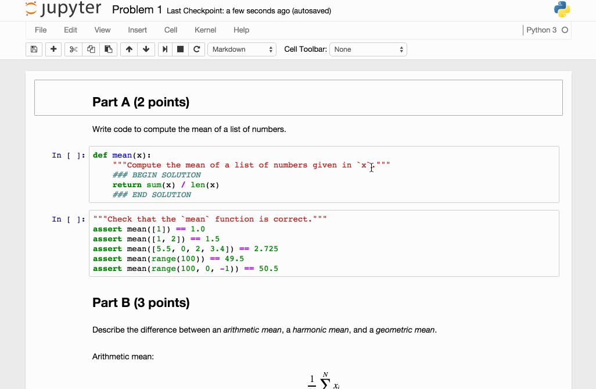
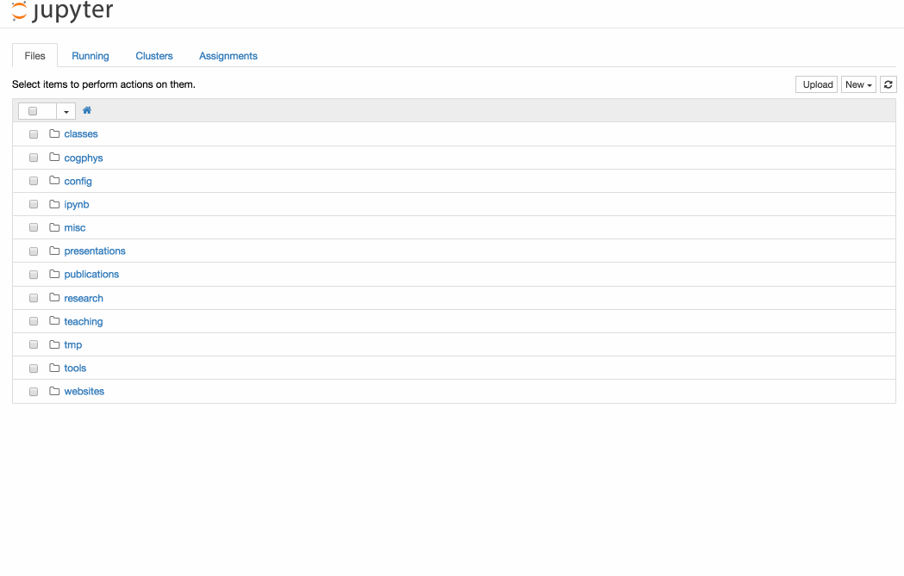

# nbgrader

A system for assigning and grading Jupyter notebooks.

[Documentation can be found on Read the Docs.](http://nbgrader.readthedocs.org)

## Visual highlights of nbgrader

### Instructor toolbar extension for Jupyter notebooks
The nbgrader toolbar extension for Jupyter notebooks guides the instructor through
assignment and grading tasks using the familiar Jupyter notebook interface.

### Student assignment list extension for Jupyter notebooks
Using the assignment list extension, students may conveniently view, fetch,
submit, and validate their assignments.

### The command line tools of nbgrader
[Command line tools](https://nbgrader.readthedocs.org/en/stable/command_line_tools/index.html)
offer an efficient way for the instructor to generate, assign, release, collect,
and grade notebooks.

* `nbgrader assign`: create a student version of a notebook
* `nbgrader release`: release a notebook to students
* `nbgrader collect`: collect students' submissions
* `nbgrader autograde`: autograde students' submissions
* `nbgrader formgrade`: launch the formgrader

## Installation

### The nbgrader system and command line tools
You may install the current version of nbgrader which includes the grading
system and command line tools:

    pip install nbgrader

### nbgrader extensions
You may then install the nbgrader extensions for Jupyter notebook. This will
install both the *create assignment* toolbar extension and *assignment list*
notebook server extension:

    nbgrader extension install

To use the toolbar extension as either an instructor or a student, activate the
extension with:

    nbgrader extension activate

If you want to install the extension for only your user environment and not
systemwide, use `nbgrader extension install --user`.
If you don't want to have to reinstall the extension when nbgrader is updated,
use `nbgrader extension install --symlink`.

To get help and see all the options you can pass while installing or activating
the nbgrader notebook extension, use:

    nbgrader extension install --help-all
    nbgrader extension activate --help-all

## Contributing

Please see the [contributing guidelines and documentation](CONTRIBUTING.md).

If you want to develop features for nbgrader, please follow the
[development installation instructions](CONTRIBUTING.md#development-installation).
